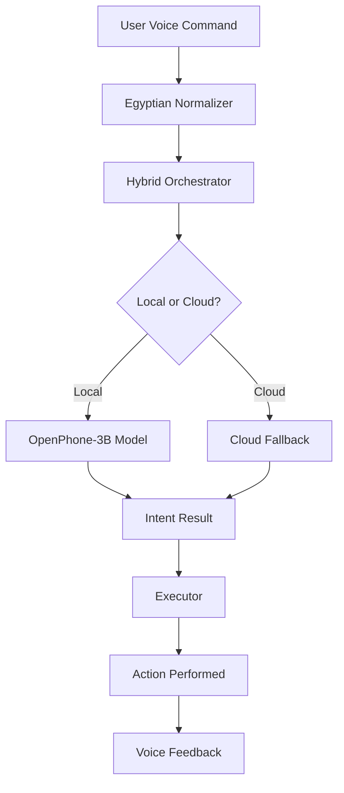

# Egyptian Agent - Complete Documentation

## Table of Contents
1. [Overview](#overview)
2. [Architecture](#architecture)
3. [Core Components](#core-components)
4. [Egyptian Dialect Processing](#egyptian-dialect-processing)
5. [Senior Mode Features](#senior-mode-features)
6. [Emergency Features](#emergency-features)
7. [Installation Guide](#installation-guide)
8. [API Reference](#api-reference)
9. [Troubleshooting](#troubleshooting)

## Overview

The Egyptian Agent is a voice-controlled assistant designed specifically for Egyptian seniors and visually impaired users. It operates completely hands-free using voice commands in Egyptian dialect and runs as a system app on Honor X6c devices.

### Key Features
- Voice-only interaction - no screen touch required
- Senior Mode with slower, louder audio and automatic fall detection
- Smart Emergencies with automatic connection to emergency services
- Simple commands that understand Egyptian dialect
- Offline operation for all core features
- System-level access even when screen is locked
- Medication reminders and guardian notifications
- Advanced Egyptian dialect normalization

### Target Device
- **Primary Device**: Honor X6c (MediaTek Helio G81 Ultra, 6GB RAM)
- **OS Requirements**: Android 12+
- **Special Requirements**: Bootloader unlocked + Root (Magisk)

## Architecture

### High-Level Architecture
```
┌─────────────────────────────────────────────────────────────┐
│                    Hardware Layer                          │
│  Microphone • Accelerometer • Volume Buttons • Vibrator    │
└─────────────────────────────────────────────────────────────┘
                              │
┌─────────────────────────────────────────────────────────────┐
│                   System App Layer                         │
│    Android OS • Root Permissions • Battery Manager        │
└─────────────────────────────────────────────────────────────┘
                              │
┌─────────────────────────────────────────────────────────────┐
│               Core Intelligence Layer                      │
│  OpenPhone-3B Model • Dynamic Orchestrator               │
│  Egyptian Dialect Engine • Fall Detection AI              │
│  Emergency Router                                         │
└─────────────────────────────────────────────────────────────┘
                              │
┌─────────────────────────────────────────────────────────────┐
│                User Experience Layer                       │
│  Voice First Interface • Senior Mode • Emergency Response │
│  Contextual Actions                                       │
└─────────────────────────────────────────────────────────────┘
```

### Component Flow


## Core Components

### VoiceService
Main service handling voice recognition and wake word detection. Manages audio focus and wake locks, and routes commands to appropriate executors.

#### Key Responsibilities:
- Wake word detection ("يا صاحبي"/"يا كبير")
- Audio focus management
- Command routing to executors
- System-level service management

### WakeWordDetector
Handles "يا صاحبي"/"يا كبير" wake word detection using Vosk for offline speech recognition with Egyptian dialect support.

### VoskSTTEngine
Offline speech-to-text engine that processes Egyptian Arabic dialect and integrates with custom vocabulary.

### EgyptianNormalizer
Converts Egyptian dialect to standard commands, handles common Egyptian expressions and variations, and extracts entities like contact names and times.

### HybridOrchestrator
Intelligently routes commands between local OpenPhone model and cloud fallback based on complexity and confidence.

## Egyptian Dialect Processing

### Supported Expressions

#### Calling Commands
| Egyptian Expression | Standard Arabic | English Equivalent |
|---------------------|-----------------|-------------------|
| اتصل بأمي | اتصل بالأم | Call mother |
| كلم بابا | اتصل بالأب | Call father |
| رن على ماما | اتصل بالأم | Call mother |
| ابعت واتساب لامي | أرسل واتساب للأم | Send WhatsApp to mother |

#### Time Expressions
| Egyptian Expression | Standard Arabic | English Equivalent |
|---------------------|-----------------|-------------------|
| بكرة الصبح | غداً الصباح | Tomorrow morning |
| بعد ساعة | بعد ساعة | After an hour |
| النهاردة | اليوم | Today |
| امبارح | أمس | Yesterday |

#### Emergency Keywords
| Egyptian Expression | Standard Arabic | English Equivalent |
|---------------------|-----------------|-------------------|
| نجدة | طوارئ | Emergency |
| استغاثة | استغاثة | Distress call |
| مش قادر | طوارئ | Can't manage |

### Normalization Process
1. **Diacritic Removal**: Removes Arabic diacritics (tashkeel)
2. **Letter Normalization**: Normalizes Egyptian letter variations
3. **Dialect Mapping**: Maps Egyptian expressions to standard Arabic
4. **Entity Extraction**: Identifies contacts, times, and other entities
5. **Numerical Conversion**: Converts Arabic numerals to Western format

## Senior Mode Features

### Activation
- Say "يا كبير، شغل وضع كبار السن" to activate
- Or press the senior mode button in the app

### Benefits
- Slower, clearer speech (75% normal speed)
- Maximum volume for better hearing
- Double confirmation for actions
- Simplified command set
- Automatic fall detection
- Emergency assistance

### Command Restrictions
Senior mode limits available commands to:
- CALL_CONTACT
- EMERGENCY
- READ_TIME
- SET_ALARM
- SEND_WHATSAPP
- READ_MISSED_CALLS

## Emergency Features

### Automatic Fall Detection
Uses accelerometer to detect falls and automatically triggers emergency response.

### Emergency Activation
- Say "نجدة", "استغاثة", or "طوارئ"
- Triple-volume-button press
- Automatic detection via fall detection

### Emergency Response Protocol
1. Immediate emergency contact call
2. SMS notification to emergency contacts
3. Location sharing with emergency services
4. Guardian notification (in senior mode)

## Installation Guide

### Prerequisites
- Android SDK with build tools
- ADB (Android Debug Bridge)
- Device with unlocked bootloader and root access

### Device Preparation
```bash
# Reboot to bootloader
adb reboot bootloader

# Unlock the bootloader (this will factory reset the device)
fastboot oem unlock

# Flash patched boot image with Magisk for root access
fastboot flash boot magisk_patched.img
```

### Build and Install
```bash
# Build the application
./gradlew assembleRelease

# Run the installation script
./scripts/install_as_system_app.sh
```

### Post-Installation Setup
1. Reboot the device
2. Grant all requested permissions
3. Configure emergency contacts
4. Set up guardian notifications (optional)

## API Reference

### Core Classes

#### VoiceService
Main service for voice processing

```java
public class VoiceService extends Service {
    // Starts the voice recognition service
    public void startVoiceRecognition();
    
    // Stops the voice recognition service
    public void stopVoiceRecognition();
    
    // Handles incoming voice commands
    public void handleVoiceCommand(String command);
}
```

#### EgyptianNormalizer
Handles Egyptian dialect normalization

```java
public class EgyptianNormalizer {
    // Normalizes Egyptian dialect text
    public static String normalize(String input);
    
    // Extracts contact name from command
    public static String extractContactName(String text);
    
    // Extracts time expression from command
    public static String extractTimeExpression(String text);
}
```

#### HybridOrchestrator
Routes commands between local and cloud processing

```java
public class HybridOrchestrator {
    // Determines intent using hybrid approach
    public void determineIntent(String normalizedText, IntentCallback callback);
    
    // Checks if local model is ready
    public boolean isReady();
}
```

### Executor Classes

#### CallExecutor
Handles phone calls

```java
public class CallExecutor {
    // Executes a call command
    public static void handleCommand(Context context, String command);
}
```

#### WhatsAppExecutor
Handles WhatsApp messages

```java
public class WhatsAppExecutor {
    // Sends a WhatsApp message
    public static void handleCommand(Context context, String command);
}
```

#### AlarmExecutor
Handles alarms and reminders

```java
public class AlarmExecutor {
    // Sets an alarm
    public static void handleCommand(Context context, String command);
}
```

## Troubleshooting

### Common Issues

#### Assistant Not Responding
- Ensure microphone permissions are granted
- Check if the service is running: `adb shell dumpsys activity services | grep VoiceService`
- Verify wake word sensitivity settings

#### Call Functionality Not Working
- Verify CALL_PHONE permission is granted
- Check contact access permissions
- Ensure device has active SIM card

#### Service Stops Unexpectedly
- Check battery optimization settings
- Verify the app is set as a device administrator
- Review logs for error messages

#### Poor Voice Recognition
- Ensure quiet environment
- Speak clearly and at moderate pace
- Check microphone for obstructions

#### Senior Mode Not Activating
- Verify activation phrase recognition
- Check if the mode is properly configured
- Ensure all required permissions are granted

### Diagnostic Commands

Check service status:
```bash
adb shell dumpsys activity services | grep VoiceService
```

View logs:
```bash
adb logcat -s "VoiceService:EgyptianNormalizer:SeniorMode"
```

Check permissions:
```bash
adb shell dumpsys package com.egyptian.agent | grep permission
```

### Log Locations
- Application logs: `/sdcard/Android/data/com.egyptian.agent/files/egyptian_agent_logs/`
- System logs: `adb logcat`

## Performance Optimization

### Memory Management
- The app is optimized for 6GB RAM devices
- Uses caching to minimize memory allocations
- Implements proper garbage collection

### Battery Optimization
- Uses efficient wake locks
- Minimizes background processing
- Implements power-efficient algorithms

### Processing Efficiency
- Local processing for common commands
- Cloud fallback for complex queries
- Adaptive processing based on device capabilities

## Security & Privacy

### Data Handling
- All voice processing happens offline on the device
- No personal data is sent to external servers
- Call logs and contacts are only accessed locally
- All data is encrypted on the device

### Permissions Used
- RECORD_AUDIO: For voice command recognition
- CALL_PHONE: To make phone calls
- READ_CONTACTS: To access contact names and numbers
- BODY_SENSORS: For fall detection using accelerometer
- SYSTEM_ALERT_WINDOW: For overlay functionality
- WAKE_LOCK: To maintain operation in background

## Support & Maintenance

### Updates
The application supports over-the-air updates for non-critical features while maintaining core functionality offline.

### Backup and Restore
User preferences and emergency contacts can be backed up and restored through the settings menu.

### Customer Support
For technical support, contact the development team through the in-app feedback system or emergency guardian notification feature.

---

## Appendix: Command Examples

### Basic Commands
- "يا صاحبي" - Activate the assistant
- "اتصل بأمي" - Call mother
- "فايتة عليا" - Read missed calls
- "نبهني بكرة الصبح" - Set alarm for tomorrow morning
- "نجدة" - Connect to emergency services immediately

### Senior Mode Commands
- "يا كبير، شغل وضع كبار السن" - Activate senior mode
- "يا كبير، خروج من وضع كبار السن" - Deactivate senior mode
- "يا كبير، ابعت رسالة لامي إنني بخير" - Send WhatsApp to mother
- "يا كبير، اتصل بجارة" - Call neighbor

### Advanced Commands
- "يا صاحبي، قوللي الوقت" - Get current time
- "يا صاحبي، ابعت واتساب لدكتور أحمد إن appointment confirmed" - Send WhatsApp to doctor
- "يا صاحبي، نبهني بعد ساعتين" - Set alarm for 2 hours from now