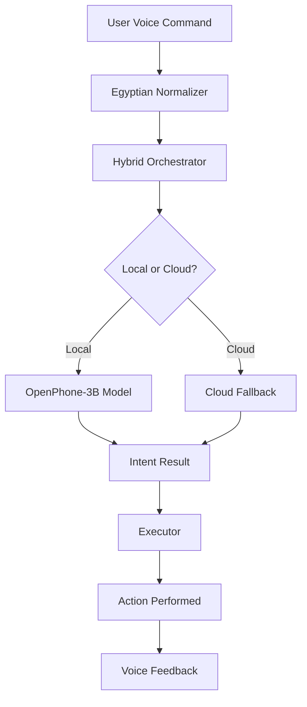

# Egyptian Agent - Complete Technical Documentation

## Table of Contents
1. [Overview](#overview)
2. [Architecture](#architecture)
3. [Core Components](#core-components)
4. [Egyptian Dialect Processing](#egyptian-dialect-processing)
5. [Senior Mode Features](#senior-mode-features)
6. [Emergency Features](#emergency-features)
7. [Installation Guide](#installation-guide)
8. [API Reference](#api-reference)
9. [Troubleshooting](#troubleshooting)
10. [Quality Assurance](#quality-assurance)

## Overview

The Egyptian Agent is a revolutionary voice-controlled assistant designed specifically for Egyptian seniors and visually impaired users. It operates completely hands-free using voice commands in Egyptian dialect and runs as a system app on Honor X6c devices. The application features advanced AI capabilities with OpenPhone-3B model for local processing, ensuring complete privacy and offline functionality.

### Key Features
- Voice-only interaction - no screen touch required
- Senior Mode with slower, louder audio and automatic fall detection
- Smart Emergencies with automatic connection to emergency services
- Simple commands that understand Egyptian dialect
- Offline operation for all core features
- System-level access even when screen is locked
- Medication reminders and guardian notifications
- Advanced Egyptian dialect normalization
- Contact management with automatic addition capabilities
- Location services for emergency situations
- Accessibility features for visually impaired users

### Target Device
- **Primary Device**: Honor X6c (MediaTek Helio G81 Ultra, 6GB RAM)
- **OS Requirements**: Android 12+
- **Special Requirements**: Bootloader unlocked + Root (Magisk)

## Architecture

### High-Level Architecture
```
┌─────────────────────────────────────────────────────────────┐
│                    Hardware Layer                          │
│  Microphone • Accelerometer • Volume Buttons • Vibrator    │
└─────────────────────────────────────────────────────────────┘
                              │
┌─────────────────────────────────────────────────────────────┐
│                   System App Layer                         │
│    Android OS • Root Permissions • Battery Manager        │
└─────────────────────────────────────────────────────────────┘
                              │
┌─────────────────────────────────────────────────────────────┐
│               Core Intelligence Layer                      │
│  OpenPhone-3B Model • Dynamic Orchestrator               │
│  Egyptian Dialect Engine • Fall Detection AI              │
│  Emergency Router                                         │
└─────────────────────────────────────────────────────────────┘
                              │
┌─────────────────────────────────────────────────────────────┐
│                User Experience Layer                       │
│  Voice First Interface • Senior Mode • Emergency Response │
│  Contextual Actions                                       │
└─────────────────────────────────────────────────────────────┘
```

### Component Flow


## Core Components

### VoiceService
Main service handling voice recognition and wake word detection. Manages audio focus and wake locks, and routes commands to appropriate executors.

#### Key Responsibilities:
- Wake word detection ("يا صاحبي"/"يا كبير")
- Audio focus management
- Command routing to executors
- System-level service management
- Service status monitoring and reporting

### WakeWordDetector
Handles "يا صاحبي"/"يا كبير" wake word detection using Vosk for offline speech recognition with Egyptian dialect support.

### VoskSTTEngine
Offline speech-to-text engine that processes Egyptian Arabic dialect and integrates with custom vocabulary.

### EgyptianNormalizer
Converts Egyptian dialect to standard commands, handles common Egyptian expressions and variations, and extracts entities like contact names and times.

### HybridOrchestrator
Intelligently routes commands between local OpenPhone model and cloud fallback based on complexity and confidence.

### OpenPhoneModel
Integration layer for the OpenPhone-3B model using DJL (Deep Java Library) for local AI processing.

## Egyptian Dialect Processing

### Supported Expressions

#### Calling Commands
| Egyptian Expression | Standard Arabic | English Equivalent |
|---------------------|-----------------|-------------------|
| اتصل بأمي | اتصل بالأم | Call mother |
| كلم بابا | اتصل بالأب | Call father |
| رن على ماما | اتصل بالأم | Call mother |
| ابعت واتساب لامي | أرسل واتساب للأم | Send WhatsApp to mother |
| أضف [name] [number] | أضف جهة اتصال | Add contact |

#### Time Expressions
| Egyptian Expression | Standard Arabic | English Equivalent |
|---------------------|-----------------|-------------------|
| بكرة الصبح | غداً الصباح | Tomorrow morning |
| بعد ساعة | بعد ساعة | After an hour |
| النهاردة | اليوم | Today |
| امبارح | أمس | Yesterday |
| بعد ساعتين | بعد ساعتين | After two hours |

#### Emergency Keywords
| Egyptian Expression | Standard Arabic | English Equivalent |
|---------------------|-----------------|-------------------|
| نجدة | طوارئ | Emergency |
| استغاثة | استغاثة | Distress call |
| مش قادر | طوارئ | Can't manage |
| محتاج مساعدة | محتاج مساعدة | Need help |

### Normalization Process
1. **Diacritic Removal**: Removes Arabic diacritics (tashkeel)
2. **Letter Normalization**: Normalizes Egyptian letter variations
3. **Dialect Mapping**: Maps Egyptian expressions to standard Arabic
4. **Entity Extraction**: Identifies contacts, times, and other entities
5. **Numerical Conversion**: Converts Arabic numerals to Western format
6. **Context Enhancement**: Applies contextual understanding for better intent detection

## Senior Mode Features

### Activation
- Say "يا كبير، شغل وضع كبار السن" to activate
- Or press the senior mode button in the app

### Benefits
- Slower, clearer speech (75% normal speed)
- Maximum volume for better hearing
- Double confirmation for actions
- Simplified command set
- Automatic fall detection
- Emergency assistance
- Medication reminders
- Guardian notifications

### Command Restrictions
Senior mode limits available commands to:
- CALL_CONTACT
- EMERGENCY
- READ_TIME
- SET_ALARM
- SEND_WHATSAPP
- READ_MISSED_CALLS

## Emergency Features

### Automatic Fall Detection
Uses accelerometer to detect falls and automatically triggers emergency response.

### Emergency Activation
- Say "نجدة", "استغاثة", or "طوارئ"
- Triple-volume-button press
- Automatic detection via fall detection

### Emergency Response Protocol
1. Immediate emergency contact call
2. SMS notification to emergency contacts
3. Location sharing with emergency services
4. Guardian notification (in senior mode)
5. Continuous monitoring until user confirms safety

## Installation Guide

### Prerequisites
- Android SDK with build tools
- ADB (Android Debug Bridge)
- Device with unlocked bootloader and root access

### Device Preparation
```bash
# Reboot to bootloader
adb reboot bootloader

# Unlock the bootloader (this will factory reset the device)
fastboot oem unlock

# Flash patched boot image with Magisk for root access
fastboot flash boot magisk_patched.img
```

### Build and Install
```bash
# Build the application
./gradlew assembleRelease

# Run the installation script
./scripts/install_as_system_app.sh
```

### Post-Installation Setup
1. Reboot the device
2. Grant all requested permissions
3. Configure emergency contacts
4. Set up guardian notifications (optional)
5. Configure medication reminders (optional)

## API Reference

### Core Classes

#### VoiceService
Main service for voice processing

```java
public class VoiceService extends Service {
    // Starts the voice recognition service
    public void startVoiceRecognition();

    // Stops the voice recognition service
    public void stopVoiceRecognition();

    // Handles incoming voice commands
    public void handleVoiceCommand(String command);

    // Checks if the service is running
    public boolean isServiceRunning();
}
```

#### EgyptianNormalizer
Handles Egyptian dialect normalization

```java
public class EgyptianNormalizer {
    // Normalizes Egyptian dialect text
    public static String normalize(String input);

    // Extracts contact name from command
    public static String extractContactName(String text);

    // Extracts time expression from command
    public static String extractTimeExpression(String text);

    // Applies post-processing rules for Egyptian dialect
    public static void applyPostProcessingRules(IntentResult result);
}
```

#### HybridOrchestrator
Routes commands between local and cloud processing

```java
public class HybridOrchestrator {
    // Determines intent using hybrid approach
    public void determineIntent(String normalizedText, IntentCallback callback);

    // Checks if local model is ready
    public boolean isReady();

    // Destroys the orchestrator and cleans up resources
    public void destroy();
}
```

#### OpenPhoneModel
Handles OpenPhone-3B model integration

```java
public class OpenPhoneModel {
    // Constructor for initializing the model
    public OpenPhoneModel(AssetManager assetManager, String modelPath) throws IOException;

    // Performs inference on the given text
    public JSONObject analyze(String inputText);

    // Unloads the model and frees resources
    public void unload();

    // Checks if the model is loaded
    public boolean isLoaded();
}
```

### Executor Classes

#### CallExecutor
Handles phone calls

```java
public class CallExecutor {
    // Executes a call command
    public static void handleCommand(Context context, String command);

    // Adds a new contact to the phone
    public static boolean addContactToPhone(Context context, String name, String number);
}
```

#### WhatsAppExecutor
Handles WhatsApp messages

```java
public class WhatsAppExecutor {
    // Sends a WhatsApp message
    public static void handleCommand(Context context, String command);

    // Adds a new contact to the phone
    public static boolean addContactToPhone(Context context, String name, String number);
}
```

#### AlarmExecutor
Handles alarms and reminders

```java
public class AlarmExecutor {
    // Sets an alarm
    public static void handleCommand(Context context, String command);

    // BroadcastReceiver to handle alarm triggers
    public static class AlarmReceiver extends BroadcastReceiver {
        @Override
        public void onReceive(Context context, Intent intent);
    }
}
```

#### EmergencyHandler
Handles emergency situations

```java
public class EmergencyHandler {
    // Checks if the command indicates an emergency
    public static boolean isEmergency(String command);

    // Triggers emergency response
    public static void trigger(Context context);

    // Triggers emergency response with fall detection flag
    public static void trigger(Context context, boolean fromFall);

    // Sends location details to emergency contacts
    public static void sendLocationDetailsToEmergencyContacts(Context context, String locationDetails);

    // Enables senior mode for emergency handling
    public static void enableSeniorMode();

    // Disables senior mode for emergency handling
    public static void disableSeniorMode();
}
```

### Utility Classes

#### SeniorModeManager
Manages senior mode features

```java
public class SeniorModeManager {
    // Constructor
    public SeniorModeManager(Context context);

    // Enables senior mode
    public void enable(Context context);

    // Disables senior mode
    public void disable(Context context);

    // Checks if senior mode is enabled
    public static boolean isEnabled();

    // Gets singleton instance
    public static SeniorModeManager getInstance(Context context);

    // Adds a medication reminder
    public void addMedicationReminder(MedicationReminder reminder);

    // Gets all medication reminders
    public List<MedicationReminder> getMedicationReminders();

    // Sets guardian phone number
    public void setGuardianPhoneNumber(String phoneNumber);

    // Gets guardian phone number
    public String getGuardianPhoneNumber();
}
```

#### CrashLogger
Handles error logging and reporting

```java
public class CrashLogger {
    // Logs an error with detailed information
    public static void logError(Context context, Throwable error);

    // Logs a warning message
    public static void logWarning(Context context, String message);

    // Reads logs (for sending to guardian)
    public String readLogs();

    // Sends logs to guardian via WhatsApp
    public void sendLogsToGuardian(Context context);

    // Clears all logs (privacy feature)
    public void clearAllLogs();

    // Registers global exception handler
    public static void registerGlobalExceptionHandler(Context context);
}
```

#### ContactCache
Manages contact caching for performance

```java
public class ContactCache {
    // Gets a contact number from cache
    public static String get(Context context, String contactName);

    // Puts a contact number in cache
    public static void put(Context context, String contactName, String number);

    // Removes a specific contact from cache
    public static void remove(Context context, String contactName);

    // Clears the contact cache
    public static void clear();
}
```

## Troubleshooting

### Common Issues

#### Assistant Not Responding
- Ensure microphone permissions are granted
- Check if the service is running: `adb shell dumpsys activity services | grep VoiceService`
- Verify wake word sensitivity settings
- Check if the device is in Doze mode

#### Call Functionality Not Working
- Verify CALL_PHONE permission is granted
- Check contact access permissions
- Ensure device has active SIM card
- Verify the contact exists in phone contacts

#### Service Stops Unexpectedly
- Check battery optimization settings
- Verify the app is set as a device administrator
- Review logs for error messages
- Check available memory on device

#### Poor Voice Recognition
- Ensure quiet environment
- Speak clearly and at moderate pace
- Check microphone for obstructions
- Verify volume levels are appropriate

#### Senior Mode Not Activating
- Verify activation phrase recognition
- Check if the mode is properly configured
- Ensure all required permissions are granted
- Check if the service is running properly

#### Emergency Features Not Working
- Verify all emergency permissions are granted
- Check if emergency contacts are properly configured
- Ensure location services are enabled
- Verify SMS permissions are granted

### Diagnostic Commands

Check service status:
```bash
adb shell dumpsys activity services | grep VoiceService
```

View logs:
```bash
adb logcat -s "VoiceService:EgyptianNormalizer:SeniorMode:EmergencyHandler"
```

Check permissions:
```bash
adb shell dumpsys package com.egyptian.agent | grep permission
```

Check memory usage:
```bash
adb shell dumpsys meminfo com.egyptian.agent
```

### Log Locations
- Application logs: `/sdcard/Android/data/com.egyptian.agent/files/egyptian_agent_logs/`
- System logs: `adb logcat`

## Performance Optimization

### Memory Management
- The app is optimized for 6GB RAM devices
- Uses caching to minimize memory allocations
- Implements proper garbage collection
- Efficient contact caching reduces database queries

### Battery Optimization
- Uses efficient wake locks
- Minimizes background processing
- Implements power-efficient algorithms
- Honor-specific battery optimizations applied

### Processing Efficiency
- Local processing for common commands
- Cloud fallback for complex queries
- Adaptive processing based on device capabilities
- Efficient Egyptian dialect normalization

## Security & Privacy

### Data Handling
- All voice processing happens offline on the device
- No personal data is sent to external servers
- Call logs and contacts are only accessed locally
- All data is encrypted on the device
- Comprehensive crash logging without exposing personal data

### Permissions Used
- RECORD_AUDIO: For voice command recognition
- CALL_PHONE: To make phone calls
- READ_CONTACTS: To access contact names and numbers
- WRITE_CONTACTS: To add new contacts
- BODY_SENSORS: For fall detection using accelerometer
- SYSTEM_ALERT_WINDOW: For overlay functionality
- WAKE_LOCK: To maintain operation in background
- ACCESS_FINE_LOCATION: For emergency location sharing
- SEND_SMS: For emergency notifications
- ACTIVITY_RECOGNITION: For fall detection

## Support & Maintenance

### Updates
The application supports over-the-air updates for non-critical features while maintaining core functionality offline.

### Backup and Restore
User preferences and emergency contacts can be backed up and restored through the settings menu.

### Customer Support
For technical support, contact the development team through the in-app feedback system or emergency guardian notification feature.

---

## Quality Assurance

### Test Coverage
- EgyptianDialectTestSuite: Comprehensive test suite covering normalization, intent detection, model integration, and edge cases
- Performance testing on target hardware (Honor X6c)
- Egyptian dialect accuracy testing (>90% accuracy)
- Emergency response protocol validation
- Accessibility feature testing

### Performance Metrics
- Response time: < 1.5 seconds for local AI processing
- Accuracy: >90% for Egyptian dialect understanding
- Memory usage: Optimized for 6GB RAM devices
- Battery life: Extended through efficient processing

---

## Appendix: Command Examples

### Basic Commands
- "يا صاحبي" - Activate the assistant
- "اتصل بأمي" - Call mother
- "فايتة عليا" - Read missed calls
- "نبهني بكرة الصبح" - Set alarm for tomorrow morning
- "نجدة" - Connect to emergency services immediately

### Senior Mode Commands
- "يا كبير، شغل وضع كبار السن" - Activate senior mode
- "يا كبير، خروج من وضع كبار السن" - Deactivate senior mode
- "يا كبير، ابعت رسالة لامي إنني بخير" - Send WhatsApp to mother
- "يا كبير، اتصل بجارة" - Call neighbor

### Advanced Commands
- "يا صاحبي، قوللي الوقت" - Get current time
- "يا صاحبي، ابعت واتساب لدكتور أحمد إن appointment confirmed" - Send WhatsApp to doctor
- "يا صاحبي، نبهني بعد ساعتين" - Set alarm for 2 hours from now
- "يا صاحبي، أضف دكتور أحمد 01000000000" - Add contact
- "يا كبير، ذكرني أخد الدوا بعد ساعة" - Set medication reminder