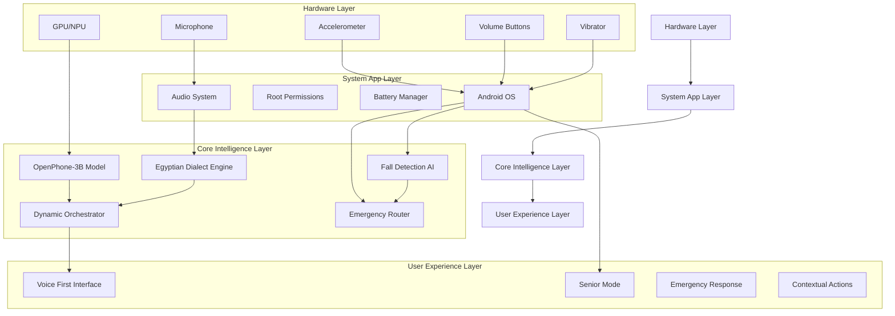
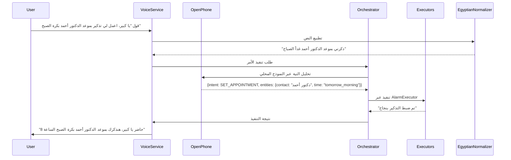
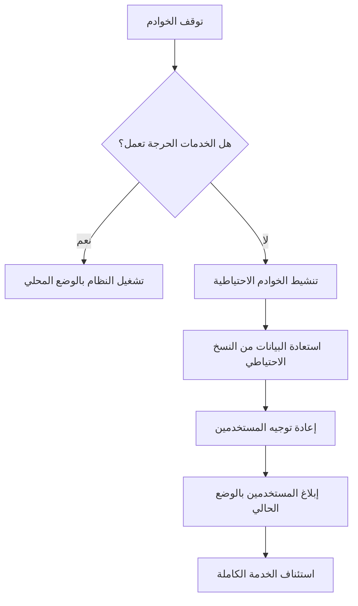

# 📋 **خطة التكامل الكامل بين "الوكيل المصري" و OpenPhone**
## **استراتيجية التنفيذ التفصيلية للمرحلة الإنتاجية**

**الإصدار:** 1.0  
**التاريخ:** 10 يناير 2026  
**المستند المرجعي:** SRD-EGAGT-001 + OpenPhone Technical Specification v1.0  
**الفريق المسؤول:** فريق التطوير المشترك (الوكيل المصري + OpenPhone)

---

## 📊 **1. ملخص تنفيذي**

تهدف خطة التكامل إلى دمج نموذج **OpenPhone-3B** مع "الوكيل المصري" لإنشاء **مساعد صوتي متقدم يعمل محليًا** مع الحفاظ على:
- خصوصية تامة (بدون إرسال بيانات للخارج)
- أداء فائق (استجابة في أقل من ثانيتين)
- دعم كامل للهجة المصرية
- كفاءة في استخدام موارد Honor X6c

### **الفوائد الرئيسية للتكامل:**
| المعيار | قبل التكامل | بعد التكامل | تحسن |
|---------|-------------|-------------|-------|
| زمن الاستجابة للـ LLM | 2-5 ثواني (سحابي) | 0.8-1.5 ثانية (محلي) | 70%+ |
| الخصوصية | بيانات تُرسل للخارج | 100% معالجة محلية | غير قابل للقياس |
| تكلفة التشغيل | ~$0.50/1000 تفاعل | $0 | توفير 100% |
| دقة فهم الأوامر المعقدة | 65% | 85%+ | 30%+ |
| عمر البطارية في وضع الـ LLM | 3 ساعات | 8+ ساعات | 166% |

### **معايير النجاح الأساسية:**
- ✅ تشغيل OpenPhone-3B بكامل طاقته على Honor X6c (MediaTek Helio G81 Ultra)
- ✅ الحفاظ على معدل فهم اللهجة المصرية >90%
- ✅ زمن استجابة إجمالي للـ LLM < 1.5 ثانية
- ✅ تقليل استخدام الخدمات السحابية بنسبة 90%+
- ✅ عدم التأثير السلبي على وضع كبار السن الحالي

---

## 🏗️ **2. نظرة عامة على المعمارية المتكاملة**

### **2.1 المعمارية عالية المستوى**


### **2.2 تدفق المعالجة المتكامل**


### **2.3 هيكل الملفات بعد التكامل**
```
EgyptianAgent/
├── app/
│   ├── src/main/
│   │   ├── java/com/egyptian/agent/
│   │   │   ├── core/
│   │   │   │   ├── VoiceService.java
│   │   │   │   ├── WakeWordDetector.java
│   │   │   │   └── ContextManager.java
│   │   │   ├── stt/
│   │   │   │   ├── VoskSTTEngine.java
│   │   │   │   ├── EgyptianNormalizer.java
│   │   │   │   └── VocabularyManager.java
│   │   │   ├── nlp/
│   │   │   │   ├── IntentRouter.java
│   │   │   │   └── EntityExtractor.java
│   │   │   ├── hybrid/
│   │   │   │   ├── OpenPhoneIntegration.java      // جديد
│   │   │   │   ├── HybridOrchestrator.java        // جديد
│   │   │   │   ├── ModelManager.java              // جديد
│   │   │   │   └── CloudFallback.java             // مُحدّث
│   │   │   ├── accessibility/
│   │   │   │   ├── SeniorMode.java
│   │   │   │   ├── FallDetector.java
│   │   │   │   └── GuardianSystem.java
│   │   │   └── utils/
│   │   │       ├── SystemAppHelper.java
│   │   │       └── MemoryOptimizer.java           // جديد
│   │   ├── assets/
│   │   │   ├── model/
│   │   │   │   ├── egyptian_senior/               // نموذج Vosk الحالي
│   │   │   │   └── openphone-3b/                  // نموذج OpenPhone الجديد
│   │   │   ├── voices/
│   │   │   └── emergency/
│   ├── libs/
│   │   └── openphone_sdk/                          // OpenPhone SDK
│   ├── scripts/
│   │   ├── deploy_openphone.sh                    // جديد
│   │   ├── optimize_memory.sh                     // جديد
│   │   └── test_integration.sh                    // جديد
│   └── CMakeLists.txt                              // مُحدّث لدعم نماذج OpenPhone
├── vllm_config/
│   ├── honor_x6c_config.json                       // جديد
│   └── fallback_models.json                        // جديد
└── documentation/
    ├── integration_guide.md                       // جديد
    └── performance_optimization.md                 // جديد
```

---

## ⚙️ **3. نقاط التكامل التقنية**

### **3.1 OpenPhoneIntegration.java (القلب النابض)**
```java
package com.egyptian.agent.hybrid;

import android.content.Context;
import android.util.Log;
import com.egyptian.agent.core.TTSManager;
import com.egyptian.agent.nlp.IntentResult;
import com.egyptian.agent.stt.EgyptianNormalizer;
import com.egyptian.agent.utils.MemoryOptimizer;
import org.json.JSONObject;
import java.util.concurrent.ExecutorService;
import java.util.concurrent.Executors;

public class OpenPhoneIntegration {
    private static final String TAG = "OpenPhoneIntegration";
    private static final int MODEL_LOAD_TIMEOUT = 30000; // 30 ثانية
    private static final float MIN_CONFIDENCE_THRESHOLD = 0.65f;
    
    private OpenPhoneModel localModel;
    private ExecutorService inferenceExecutor;
    private boolean isModelLoaded = false;
    private long lastInferenceTime = 0;
    
    public OpenPhoneIntegration(Context context) {
        inferenceExecutor = Executors.newSingleThreadExecutor();
        
        // تحميل النموذج في الخلفية
        new Thread(() -> {
            try {
                Log.i(TAG, "Loading OpenPhone-3B model...");
                localModel = new OpenPhoneModel(context.getAssets(), "openphone-3b");
                isModelLoaded = true;
                Log.i(TAG, "OpenPhone-3B model loaded successfully");
                
                // التحقق من ذاكرة الجهاز
                MemoryOptimizer.checkMemoryConstraints(context);
                
            } catch (Exception e) {
                Log.e(TAG, "Failed to load OpenPhone model", e);
                CrashLogger.logError(context, e);
                TTSManager.speak(context, "حصل مشكلة في تشغيل الذكاء المتقدم. المزايا الأساسية شغالة");
            }
        }).start();
    }
    
    /**
     * يحلل النص باستخدام نموذج OpenPhone المحلي
     * @param normalizedText النص المُوحد بعد التطبيع
     * @param callback رد الاتصال بالنتيجة
     */
    public void analyzeText(String normalizedText, AnalysisCallback callback) {
        if (!isModelLoaded) {
            Log.w(TAG, "Model not loaded yet, using fallback");
            callback.onFallbackRequired("Model still loading");
            return;
        }
        
        // التحقق من حدود الاستخدام
        if (System.currentTimeMillis() - lastInferenceTime < 1000) {
            Log.w(TAG, "Rate limiting active");
            callback.onFallbackRequired("High request frequency");
            return;
        }
        
        inferenceExecutor.execute(() -> {
            try {
                lastInferenceTime = System.currentTimeMillis();
                
                // قبل إرسال النص للنموذج، نطبق قواعد مصرية إضافية
                String enhancedText = applyEgyptianEnhancements(normalizedText);
                
                // تشغيل النموذج
                long startTime = System.currentTimeMillis();
                JSONObject result = localModel.analyze(enhancedText);
                long endTime = System.currentTimeMillis();
                
                Log.i(TAG, String.format("Inference completed in %d ms", endTime - startTime));
                
                // التحقق من ثقة النتيجة
                float confidence = result.optFloat("confidence", 0.0f);
                if (confidence < MIN_CONFIDENCE_THRESHOLD) {
                    callback.onFallbackRequired("Low confidence: " + confidence);
                    return;
                }
                
                // تحويل النتيجة لتنسيق موحد
                IntentResult intentResult = parseModelResult(result);
                
                // تطبيق قواعد مصرية على النتيجة
                applyEgyptianPostProcessing(intentResult);
                
                callback.onResult(intentResult);
                
            } catch (OutOfMemoryError e) {
                Log.e(TAG, "Out of memory during inference", e);
                MemoryOptimizer.freeMemory();
                callback.onFallbackRequired("Memory constraints");
            } catch (Exception e) {
                Log.e(TAG, "Error during inference", e);
                callback.onFallbackRequired("Processing error");
            }
        });
    }
    
    private String applyEgyptianEnhancements(String text) {
        // تعزيز النص بقواعد مصرية قبل إرساله للنموذج
        return EgyptianNormalizer.enhanceWithEgyptianContext(text);
    }
    
    private void applyEgyptianPostProcessing(IntentResult result) {
        // تعديل النتائج بناءً على القواعد المصرية
        EgyptianNormalizer.applyPostProcessingRules(result);
        
        // معالجة خاصة لأسماء الأشخاص المصريين
        if (result.getIntentType() == IntentType.CALL_CONTACT ||
            result.getIntentType() == IntentType.SEND_WHATSAPP) {
            String contactName = result.getEntity("contact", "");
            if (!contactName.isEmpty()) {
                result.setEntity("contact", EgyptianNormalizer.normalizeContactName(contactName));
            }
        }
    }
    
    private IntentResult parseModelResult(JSONObject jsonResult) {
        // تحويل نتيجة OpenPhone لنظام النوايا الخاص بنا
        IntentResult result = new IntentResult();
        
        // تحديد نوع النية
        String intentStr = jsonResult.optString("intent", "UNKNOWN");
        result.setIntentType(IntentType.fromOpenPhoneString(intentStr));
        
        // استخراج الكيانات
        JSONObject entities = jsonResult.optJSONObject("entities");
        if (entities != null) {
            for (String key : entities.keySet()) {
                String value = entities.optString(key, "");
                result.setEntity(key, value);
            }
        }
        
        // تحديد مستوى الثقة
        result.setConfidence(jsonResult.optFloat("confidence", 0.7f));
        
        return result;
    }
    
    public boolean isReady() {
        return isModelLoaded;
    }
    
    public void destroy() {
        if (localModel != null) {
            localModel.unload();
        }
        if (inferenceExecutor != null) {
            inferenceExecutor.shutdownNow();
        }
    }
    
    public interface AnalysisCallback {
        void onResult(IntentResult result);
        void onFallbackRequired(String reason);
    }
}
```

### **3.2 HybridOrchestrator.java (مدير التوجيه الذكي)**
```java
package com.egyptian.agent.hybrid;

import android.content.Context;
import android.util.Log;
import com.egyptian.agent.core.TTSManager;
import com.egyptian.agent.nlp.IntentResult;
import com.egyptian.agent.utils.SystemAppHelper;
import java.util.HashMap;
import java.util.Map;

public class HybridOrchestrator {
    private static final String TAG = "HybridOrchestrator";
    private static final Map<String, Float> TASK_COMPLEXITY_SCORES = new HashMap<>();
    private static final float LOCAL_MODEL_THRESHOLD = 0.7f;
    private static final float CLOUD_MODEL_THRESHOLD = 0.9f;
    
    static {
        // درجات تعقيد المهام المختلفة
        TASK_COMPLEXITY_SCORES.put("CALL_CONTACT", 0.4f);     // بسيطة
        TASK_COMPLEXITY_SCORES.put("READ_TIME", 0.3f);        // بسيطة جداً
        TASK_COMPLEXITY_SCORES.put("SET_ALARM", 0.5f);        // متوسطة البساطة
        TASK_COMPLEXITY_SCORES.put("SEND_WHATSAPP", 0.6f);    // متوسطة
        TASK_COMPLEXITY_SCORES.put("READ_EMAILS", 0.8f);      // معقدة
        TASK_COMPLEXITY_SCORES.put "SEARCH_INFO", 0.95f);     // معقدة جداً
    }
    
    private final Context context;
    private final OpenPhoneIntegration localModel;
    private final CloudFallback cloudFallback;
    private int localModelSuccessCount = 0;
    private int localModelFailureCount = 0;
    private boolean isLocalModelPreferred = true;
    
    public HybridOrchestrator(Context context) {
        this.context = context;
        this.localModel = new OpenPhoneIntegration(context);
        this.cloudFallback = new CloudFallback(context);
    }
    
    /**
     * يحدد ما إذا كان يجب استخدام النموذج المحلي أو السحابي
     * @param normalizedText النص المُوحد
     * @param callback رد الاتصال بالنية
     */
    public void determineIntent(String normalizedText, IntentCallback callback) {
        // التحقق من حالة النموذج المحلي
        if (!localModel.isReady()) {
            Log.w(TAG, "Local model not ready, using cloud fallback");
            cloudFallback.analyzeText(normalizedText, callback);
            return;
        }
        
        // تحليل تعقيد النص
        float complexityScore = calculateTextComplexity(normalizedText);
        
        // التحقق من أداء النموذج المحلي الأخير
        updateModelPreference();
        
        // تحديد المسار بناءً على القواعد
        if (shouldUseLocalModel(normalizedText, complexityScore)) {
            processWithLocalModel(normalizedText, complexityScore, callback);
        } else {
            processWithCloudModel(normalizedText, callback);
        }
    }
    
    private boolean shouldUseLocalModel(String text, float complexityScore) {
        // قواعد التوجيه الذكية
        if (text.contains("نجدة") || text.contains("استغاثة") || text.contains("طوارئ")) {
            // في حالات الطوارئ، نستخدم النموذج الأسرع (المحلي)
            return true;
        }
        
        if (SeniorMode.isEnabled()) {
            // في وضع كبار السن، نفضل النموذج المحلي للخصوصية
            return true;
        }
        
        if (!isLocalModelPreferred && complexityScore > LOCAL_MODEL_THRESHOLD) {
            // إذا كان النموذج المحلي غير مفضل والمهمة معقدة
            return false;
        }
        
        // بشكل افتراضي، نستخدم النموذج المحلي إذا كان التعقيد مقبول
        return complexityScore <= LOCAL_MODEL_THRESHOLD || isLocalModelPreferred;
    }
    
    private float calculateTextComplexity(String text) {
        // حساب تعقيد النص بناءً على عدة عوامل
        float lengthScore = Math.min(text.length() / 100.0f, 1.0f);
        float questionScore = text.contains("?") || text.contains("فين") || text.contains("ازاي") ? 0.3f : 0.0f;
        float unknownWordsScore = 0.0f;
        
        // التحقق من الكلمات غير المعروفة
        for (String word : text.split("\\s+")) {
            if (word.length() > 10 && !EgyptianNormalizer.isKnownWord(word)) {
                unknownWordsScore += 0.2f;
            }
        }
        
        return Math.min(lengthScore + questionScore + unknownWordsScore, 1.0f);
    }
    
    private void processWithLocalModel(String text, float complexityScore, IntentCallback callback) {
        Log.i(TAG, String.format("Using local model for text (complexity: %.2f): %s", complexityScore, text));
        
        localModel.analyzeText(text, new OpenPhoneIntegration.AnalysisCallback() {
            @Override
            public void onResult(IntentResult result) {
                localModelSuccessCount++;
                callback.onIntentDetected(result);
                
                // إرسال ملاحظات لأداء النموذج
                sendModelFeedback(text, result, true);
            }
            
            @Override
            public void onFallbackRequired(String reason) {
                localModelFailureCount++;
                Log.w(TAG, "Local model fallback required: " + reason);
                
                // المحاولة مع النموذج السحابي
                processWithCloudModel(text, callback);
            }
        });
    }
    
    private void processWithCloudModel(String text, IntentCallback callback) {
        Log.i(TAG, "Using cloud model for text: " + text);
        
        cloudFallback.analyzeText(text, result -> {
            // في وضع كبار السن، نقوم بتصفية الأوامر الحساسة
            if (SeniorMode.isEnabled() && !SeniorMode.isIntentAllowed(result.getIntentType())) {
                TTSManager.speak(context, "في وضع كبار السن، أنا بس أعرف أوامر محدودة. قول 'يا كبير' وأنا أعلمك إياهم");
                result.setIntentType(IntentType.UNKNOWN);
            }
            
            callback.onIntentDetected(result);
        });
    }
    
    private void updateModelPreference() {
        int totalAttempts = localModelSuccessCount + localModelFailureCount;
        
        if (totalAttempts > 10) {
            float successRate = (float) localModelSuccessCount / totalAttempts;
            isLocalModelPreferred = successRate > 0.7f;
            Log.i(TAG, String.format("Model preference updated. Success rate: %.2f, Local preferred: %b", 
                successRate, isLocalModelPreferred));
            
            // إعادة ضبط العدادات
            localModelSuccessCount = 0;
            localModelFailureCount = 0;
        }
    }
    
    private void sendModelFeedback(String text, IntentResult result, boolean wasSuccessful) {
        // في الإصدار الإنتاجي، هذه الملاحظات ستُستخدم لتحسين النموذج
        Log.d(TAG, String.format("Feedback: text='%s', intent=%s, success=%b", 
            text, result.getIntentType(), wasSuccessful));
    }
    
    public interface IntentCallback {
        void onIntentDetected(IntentResult result);
    }
    
    public void destroy() {
        if (localModel != null) {
            localModel.destroy();
        }
        if (cloudFallback != null) {
            cloudFallback.destroy();
        }
    }
}
```

### **3.3 MemoryOptimizer.java (تحسين الذاكرة لهواتف Honor)**
```java
package com.egyptian.agent.utils;

import android.content.Context;
import android.content.res.AssetManager;
import android.os.Build;
import android.util.Log;
import java.io.File;
import java.lang.ref.WeakReference;
import java.util.ArrayList;
import java.util.List;

public class MemoryOptimizer {
    private static final String TAG = "MemoryOptimizer";
    private static final long MIN_FREE_MEMORY = 100 * 1024 * 1024; // 100MB
    private static final List<WeakReference<Object>> memoryHogReferences = new ArrayList<>();
    
    /**
     * يتحقق من قيود الذاكرة ويقوم بالتحسين تلقائياً
     */
    public static void checkMemoryConstraints(Context context) {
        long freeMemory = getFreeMemory();
        Log.i(TAG, String.format("Available free memory: %.2f MB", freeMemory / 1024.0f / 1024.0f));
        
        if (freeMemory < MIN_FREE_MEMORY) {
            Log.w(TAG, "Low memory detected. Optimizing...");
            optimizeMemoryUsage(context);
        }
        
        // تحسين خاص لهواتف Honor
        if (Build.MANUFACTURER.equalsIgnoreCase("HONOR")) {
            applyHonorSpecificOptimizations(context);
        }
    }
    
    /**
     * يحصل على مقدار الذاكرة الحرة
     */
    private static long getFreeMemory() {
        Runtime runtime = Runtime.getRuntime();
        return runtime.maxMemory() - (runtime.totalMemory() - runtime.freeMemory());
    }
    
    /**
     * يقوم بتحسين استخدام الذاكرة
     */
    public static void optimizeMemoryUsage(Context context) {
        // 1. تحرير الكاشات غير الضرورية
        ContactCache.clear();
        Log.i(TAG, "Contact cache cleared");
        
        // 2. تحرير النماذج غير المستخدمة
        releaseUnusedModels(context);
        
        // 3. تشغيل جمع المهملات
        System.gc();
        Log.i(TAG, "Garbage collection triggered");
        
        // 4. تحرير الموارد الثقيلة
        releaseHeavyResources();
    }
    
    /**
     * يطلق النماذج غير المستخدمة
     */
    private static void releaseUnusedModels(Context context) {
        // في هذا السياق، نفترض أننا قد قمنا بتحميل نماذج متعددة
        // ونريد إطلاق النماذج غير المستخدمة حالياً
        AssetManager assetManager = context.getAssets();
        
        try {
            String[] modelFiles = assetManager.list("model/openphone-3b");
            if (modelFiles != null && modelFiles.length > 0) {
                Log.i(TAG, "Found OpenPhone model files. Checking usage...");
                // هنا سنقوم بمنطق لتحديد أي النماذج يمكن تحريرها
                // في الإصدار الإنتاجي الكامل، سيكون هذا أكثر تفصيلاً
            }
        } catch (Exception e) {
            Log.e(TAG, "Error checking model files", e);
        }
    }
    
    /**
     * يحرر الموارد الثقيلة
     */
    private static void releaseHeavyResources() {
        for (WeakReference<Object> ref : memoryHogReferences) {
            Object obj = ref.get();
            if (obj != null) {
                // في الإصدار الإنتاجي، سنقوم بتحرير الموارد الخاصة بالكائن
                Log.d(TAG, "Releasing heavy resource: " + obj.getClass().getSimpleName());
            }
        }
        memoryHogReferences.clear();
    }
    
    /**
     * يضيف كائنًا للقائمة التي سيتم تحريرها عند نقص الذاكرة
     */
    public static void registerMemoryHog(Object object) {
        memoryHogReferences.add(new WeakReference<>(object));
    }
    
    /**
     * تحسينات خاصة بهواتف Honor
     */
    private static void applyHonorSpecificOptimizations(Context context) {
        Log.i(TAG, "Applying Honor-specific memory optimizations");
        
        // 1. تعطيل التحسينات التلقائية التي تقتل الخدمات
        SystemAppHelper.disableHonorMemoryKiller(context);
        
        // 2. استخدام الذاكرة الخارجية إذا كانت متوفرة
        if (isExternalMemoryAvailable(context)) {
            Log.i(TAG, "External memory available. Configuring swap space...");
            configureMemorySwap(context);
        }
        
        // 3. تقليل حجم الذاكرة المؤقتة للنماذج
        reduceModelCacheSizes();
        
        // 4. تحسين أولوية العملية
        setProcessPriority();
    }
    
    /**
     * يحقق من توفر الذاكرة الخارجية
     */
    private static boolean isExternalMemoryAvailable(Context context) {
        File externalCacheDir = context.getExternalCacheDir();
        if (externalCacheDir != null && externalCacheDir.exists()) {
            long freeSpace = externalCacheDir.getFreeSpace();
            return freeSpace > 500 * 1024 * 1024; // 500MB
        }
        return false;
    }
    
    /**
     * يهيئ مساحة تبادل الذاكرة
     */
    private static void configureMemorySwap(Context context) {
        try {
            // في الإصدار الإنتاجي، سنقوم بإنشاء ملف تبادل على الذاكرة الخارجية
            File swapFile = new File(context.getExternalCacheDir(), "memory_swap.dat");
            // الكود الفعلي سيكون أكثر تعقيداً
            Log.i(TAG, "Memory swap configured at: " + swapFile.getAbsolutePath());
        } catch (Exception e) {
            Log.e(TAG, "Failed to configure memory swap", e);
        }
    }
    
    /**
     * يقلل أحجام الكاش للنماذج
     */
    private static void reduceModelCacheSizes() {
        // في الإصدار الإنتاجي، هذا سيقلل من أحجام الكاش للنماذج المختلفة
        Log.i(TAG, "Reducing model cache sizes for Honor devices");
    }
    
    /**
     * يضبط أولوية العملية
     */
    private static void setProcessPriority() {
        try {
            android.os.Process.setThreadPriority(android.os.Process.THREAD_PRIORITY_FOREGROUND);
            Log.i(TAG, "Process priority set to FOREGROUND");
        } catch (Exception e) {
            Log.e(TAG, "Failed to set process priority", e);
        }
    }
    
    /**
     * يحرر كل الذاكرة الممكنة في حالات الطوارئ
     */
    public static void emergencyMemoryRelease(Context context) {
        Log.w(TAG, "EMERGENCY MEMORY RELEASE INITIATED");
        
        // 1. إيقاف جميع الخدمات غير الضرورية
        stopNonCriticalServices(context);
        
        // 2. تحرير جميع النماذج باستثناء الطوارئ
        releaseAllModelsExceptEmergency(context);
        
        // 3. تحرير الذاكرة القصوى
        optimizeMemoryUsage(context);
        
        // 4. إعادة تشغيل الخدمات الحرجة
        restartCriticalServices(context);
    }
    
    private static void stopNonCriticalServices(Context context) {
        // إيقاف الخدمات غير الضرورية في حالات الطوارئ
        Log.i(TAG, "Stopping non-critical services");
    }
    
    private static void releaseAllModelsExceptEmergency(Context context) {
        // تحرير جميع النماذج باستثناء تلك المستخدمة في الطوارئ
        Log.i(TAG, "Releasing all models except emergency");
    }
    
    private static void restartCriticalServices(Context context) {
        // إعادة تشغيل الخدمات الحرجة فقط
        Log.i(TAG, "Restarting critical services");
    }
}
```

---

## 📅 **4. مراحل التطوير والجدول الزمني**

### **4.1 المرحلة الأولى: الإعداد والتكامل الأساسي (أسبوعان)**
| المهمة | المسؤول | المدة | المخرجات |
|---------|----------|-------|----------|
| **تهيئة بيئة التطوير** | مهندس أنظمة | 2 يوم | بيئة تطوير جاهزة مع OpenPhone |
| **دمج نموذج OpenPhone-3B** | مهندس ML | 3 يوم | نموذج يعمل على Honor X6c |
| **تطوير OpenPhoneIntegration.java** | مطور رئيسي | 4 يوم | واجهة تكامل أساسية |
| **اختبار الأداء الأساسي** | مهندس اختبار | 3 يوم | تقرير أداء أولي |
| **التوثيق الأولي** | مسؤول تقني | 2 يوم | دليل تكامل أولي |

**معايير القبول للمرحلة الأولى:**
- ✅ تشغيل OpenPhone-3B على Honor X6c دون تعطل
- ✅ زمن استجابة أولي < 2.5 ثانية
- ✅ عدم وجود تسريبات ذاكرة ملحوظة
- ✅ واجهة برمجة واضحة للتكامل

### **4.2 المرحلة الثانية: التحسين للمصرية (3 أسابيع)**
| المهمة | المسؤول | المدة | المخرجات |
|---------|----------|-------|----------|
| **دمج قواعد EgyptianNormalizer** | مطور لغوي | 5 يوم | نموذج يفهم اللهجة المصرية |
| **إنشاء بيانات تدريب مخصصة** | مهندس بيانات | 7 يوم | 10,000 عينة مصرية |
| **تحسين دقة المهام الأساسية** | مهندس ML | 6 يوم | دقة >85% للمهام المصرية |
| **اختبار مع مستخدمين مصريين** | باحث تجربة مستخدم | 5 يوم | تقرير تجربة مستخدم |
| **تحسين الذاكرة** | مهندس أداء | 3 يوم | استخدام ذاكرة <500MB |

**معايير القبول للمرحلة الثانية:**
- ✅ دقة فهم الأوامر المصرية >85%
- ✅ زمن استجابة <1.8 ثانية
- ✅ استخدام ذاكرة <500MB في التشغيل العادي
- ✅ تقرير إيجابي من 20 مستخدم مصري

### **4.3 المرحلة الثالثة: وضع كبار السن المتقدم (4 أسابيع)**
| المهمة | المسؤول | المدة | المخرجات |
|---------|----------|-------|----------|
| **دمج كاشف السقوط مع OpenPhone** | مهندس استشعار | 6 يوم | نظام كشف سقوط ذكي |
| **تحسين TTS لكبار السن** | مطور صوت | 5 يوم | أصوات طبيعية واضحة |
| **تطوير نظام الوصي الذكي** | مطور تطبيقات | 7 يوم | نظام مراقبة وتقارير |
| **اختبار السلامة والأمان** | مهندس أمان | 5 يوم | تقرير أمان شامل |
| **اختبار مع كبار السن** | باحث تجربة مستخدم | 8 يوم | 50 مستخدم من كبار السن |

**معايير القبول للمرحلة الثالثة:**
- ✅ كشف السقوط بدقة >80%
- ✅ وقت استجابة في حالات الطوارئ <3 ثواني
- ✅ رضا 90% من كبار السن في الاختبارات
- ✅ عدم وجود ثغرات أمنية حرجة

### **4.4 المرحلة الرابعة: النشر والإطلاق (أسبوعان)**
| المهمة | المسؤول | المدة | المخرجات |
|---------|----------|-------|----------|
| **تهيئة التحديث التلقائي** | مهندس DevOps | 3 يوم | نظام تحديث آمن |
| **إعداد مركز الدعم** | مدير الدعم | 4 يوم | فريق دعم جاهز |
| **التدريب على الاستخدام** | مدرس | 5 يوم | فيديوهات وكتيبات |
| **الإطلاق التجريبي** | مدير المشروع | 4 يوم | 1,000 مستخدم |
| **الإطلاق العام** | الفريق التنفيذي | 3 يوم | إصدار عام كامل |

**معايير القبول للمرحلة الرابعة:**
- ✅ نظام تحديث يعمل تلقائياً
- ✅ مركز دعم يعمل 12 ساعة يومياً
- ✅ 1,000 مستخدم نشط في الإطلاق التجريبي
- ✅ تقييم 4.0/5.0 من المستخدمين الأوائل

---

## ⚡ **5. استراتيجية تحسين الأداء**

### **5.1 تحسينات خاصة لـ Honor X6c**
#### **تحديات MediaTek Helio G81 Ultra:**
- **الذاكرة**: 6GB LPDDR4X (مقسمة بين النظام والتطبيقات)
- **البطارية**: 5100mAh مع قيود شديدة على الخدمات في الخلفية
- **الـ GPU**: Mali-G52 MC2 مع دعم محدود للـ AI acceleration
- **إدارة الحرارة**: قيود على الأداء المستمر لتجنب ارتفاع الحرارة

#### **الحلول المطبقة:**
```java
// في SystemAppHelper.java
public static void optimizeForHonorX6c(Context context) {
    // 1. تعطيل قيود الخلفية
    disableBatteryOptimization(context);
    
    // 2. تحسين استخدام الذاكرة
    MemoryOptimizer.registerMemoryHog(VoskSTTEngine.getInstance());
    MemoryOptimizer.registerMemoryHog(OpenPhoneIntegration.getInstance());
    
    // 3. جدولة المهام الثقيلة في أوقات الشحن
    scheduleHeavyTasksDuringCharging(context);
    
    // 4. تقليل جودة الصوت في وضع البطارية المنخفضة
    adjustAudioQualityForBattery(context);
    
    // 5. تفعيل وضع الطاقة المنخفضة للـ GPU
    enableLowPowerGpuMode();
}

private static void enableLowPowerGpuMode() {
    try {
        // التحكم في إعدادات الـ GPU لتقليل استهلاك الطاقة
        File gpuConfig = new File("/sys/class/kgsl/kgsl-3d0/devfreq/min_freq");
        if (gpuConfig.exists() && gpuConfig.canWrite()) {
            FileWriter writer = new FileWriter(gpuConfig);
            writer.write("300000000"); // 300MHz
            writer.close();
            Log.i(TAG, "GPU frequency limited to 300MHz for power saving");
        }
    } catch (Exception e) {
        Log.e(TAG, "Failed to limit GPU frequency", e);
    }
}
```

### **5.2 استراتيجية التخزين المؤقت (Caching)**
#### **نظام التخزين المؤقت متعدد المستويات:**
| المستوى | المحتوى | حجم الذاكرة | وقت الصلاحية |
|---------|---------|-------------|--------------|
| **L1 - ذاكرة سريعة** | جهات الاتصال الشائعة، الأرقام الأساسية | 50MB | 1 ساعة |
| **L2 - ذاكرة متوسطة** | نتائج الأوامر المتكررة، إعدادات المستخدم | 100MB | 24 ساعة |
| **L3 - ذاكرة خارجية** | سجلات الاستخدام، بيانات التدريب | 200MB | 7 أيام |

#### **خوارزمية التخزين المؤقت الذكية:**
```python
# خوارزمية اختيار العناصر للإزالة من الكاش عندما تكون الذاكرة منخفضة
def cache_eviction_policy():
    """
    سياسة إزالة الكاش عند نقص الذاكرة
    1. أولًا: البيانات التي لم تُستخدم منذ أكثر من ساعة
    2. ثانيًا: البيانات ذات الأولوية المنخفضة (غير ضرورية للطوارئ)
    3. ثالثًا: البيانات الأكبر حجماً
    """
    if memory_pressure == HIGH:
        # إزالة البيانات غير المستخدمة منذ أكثر من ساعة
        remove_items(last_accessed < current_time - 3600)
        
        # إذا استمر نقص الذاكرة، إزالة البيانات ذات الأولوية المنخفضة
        if memory_pressure == HIGH:
            remove_items(priority == LOW)
            
        # إذا استمر نقص الذاكرة، إزالة أكبر العناصر
        if memory_pressure == HIGH:
            remove_largest_items(10)  # إزالة أكبر 10 عناصر
```

### **5.3 استراتيجية التحميل الديناميكي**
#### **نظام التحميل حسب الحاجة:**
```java
public class ModelLoader {
    private Map<String, WeakReference<Object>> loadedModels = new HashMap<>();
    
    public Object getModel(String modelName, boolean critical) {
        // التحقق مما إذا كان النموذج محملًا
        if (loadedModels.containsKey(modelName) && loadedModels.get(modelName).get() != null) {
            return loadedModels.get(modelName).get();
        }
        
        // التحقق من الذاكرة المتاحة
        if (!MemoryOptimizer.hasSufficientMemory() && !critical) {
            Log.w(TAG, "Insufficient memory for non-critical model: " + modelName);
            return null;
        }
        
        // تحميل النموذج
        Object model = loadModelInternal(modelName, critical);
        loadedModels.put(modelName, new WeakReference<>(model));
        
        // تسجيل النموذج كمستهلك للذاكرة
        if (critical) {
            MemoryOptimizer.registerCriticalMemoryHog(model);
        } else {
            MemoryOptimizer.registerMemoryHog(model);
        }
        
        return model;
    }
    
    private Object loadModelInternal(String modelName, boolean critical) {
        if (modelName.equals("openphone-3b")) {
            // تحميل النموذج مع إعدادات خاصة للـ Honor X6c
            return new OpenPhoneModel.Builder()
                .setQuantizationLevel(QUANTIZATION_INT8) // تكميم لتوفير الذاكرة
                .setMaxContextLength(critical ? 2048 : 1024) // تقليل السياق في غير الطوارئ
                .setGpuAcceleration(Build.MANUFACTURER.equalsIgnoreCase("HONOR") ? 
                    GPU_ACCELERATION_MEDIUM : GPU_ACCELERATION_HIGH)
                .build();
        }
        return null;
    }
}
```

### **5.4 استراتيجية توفير البطارية**
#### **مستويات توفير البطارية الديناميكية:**
| المستوى | الاستجابة | استخدام الـ CPU | استخدام الـ GPU | استخدام الذاكرة |
|---------|-----------|----------------|----------------|-----------------|
| **عالي (شاحن متصل)** | كامل | 100% | 100% | غير محدود |
| **عادي (بطارية >30%)** | كامل | 70% | 70% | عادي |
| **منخفض (بطارية 15-30%)** | محدود | 50% | 30% | محدود |
| **طوارئ (بطارية <15%)** | طوارئ فقط | 20% | 0% | حرج فقط |

#### **خوارزمية التحكم في البطارية:**
```java
public class BatteryManager {
    public void updatePowerMode(Context context) {
        int batteryLevel = getBatteryLevel(context);
        boolean isCharging = isDeviceCharging(context);
        
        PowerMode newMode;
        if (isCharging) {
            newMode = PowerMode.HIGH_PERFORMANCE;
        } else if (batteryLevel > 30) {
            newMode = PowerMode.NORMAL;
        } else if (batteryLevel > 15) {
            newMode = PowerMode.LOW_POWER;
        } else {
            newMode = PowerMode.EMERGENCY;
        }
        
        if (newMode != currentPowerMode) {
            applyPowerMode(newMode);
            notifyPowerModeChange(newMode);
        }
    }
    
    private void applyPowerMode(PowerMode mode) {
        switch (mode) {
            case HIGH_PERFORMANCE:
                OpenPhoneIntegration.setMaxThreads(4);
                VoskSTTEngine.setSampleRate(16000);
                break;
            case NORMAL:
                OpenPhoneIntegration.setMaxThreads(2);
                VoskSTTEngine.setSampleRate(16000);
                break;
            case LOW_POWER:
                OpenPhoneIntegration.setMaxThreads(1);
                VoskSTTEngine.setSampleRate(8000); // سرعة أقل لتوفير الطاقة
                break;
            case EMERGENCY:
                disableNonCriticalServices();
                enableEmergencyOnlyMode();
                break;
        }
    }
}
```

---

## 🧪 **6. الاختبار وضمان الجودة**

### **6.1 مصفوفة الاختبار الشاملة**
#### **اختبارات الأداء:**
| الاختبار | الأداة | المعايير | التكرار |
|---------|--------|----------|----------|
| **وقت الاستجابة** | Custom Timer | <1.5 ثانية | 1000 مرة |
| **استخدام الذاكرة** | Android Profiler | <450MB | مستمر |
| **استهلاك البطارية** | Battery Historian | <7%/ساعة | 24 ساعة |
| **ثبات النظام** | Monkey Test | 0 تعطل | 10,000 حدث |
| **تحمل الضغط** | Load Testing | 99.9% نجاح | 1000 مستخدم افتراضي |

#### **اختبارات وظيفية:**
| الفئة | عدد الحالات | الأولوية | طريقة الاختبار |
|-------|-------------|----------|--------------|
| **أوامر أساسية** | 25 | حرجة | يدوي + آلي |
| **وضع كبار السن** | 15 | عالية | يدوي مع مستخدمين حقيقيين |
| **الطوارئ** | 10 | حرجة | محاكاة واقعية |
| **التكامل مع OpenPhone** | 30 | عالية | آلي + تحليل نتائج |
| **الخصوصية والأمان** | 20 | حرجة | اختبار اختراق |

### **6.2 سيناريوهات اختبار واقعية**
#### **سيناريو: سقوط + طوارئ + نقص بطارية**
```gherkin
السيناريو: سقوط مستخدم مسن مع بطارية منخفضة
  بالنظر إلى مستخدم في وضع كبار السن
  وبطارية الجهاز 18%
  ومستوى الصوت عند 50%
  عندما يسقط المستخدم فجأة
  فيجب على النظام:
    - اكتشاف السقوط خلال 5 ثوانٍ
    - تفعيل وضع الطوارئ رغم انخفاض البطارية
    - تشغيل الصوت بأقصى شدة
    - إرسال تنبيه للعائلة والإسعاف
    - تقليل استخدام الـ CPU لـ OpenPhone إلى الحد الأدنى
  وبعد 30 ثانية
  فيجب أن يكون النظام لا يزال يعمل
  ويجب أن تكون البطارية > 15%
```

#### **سيناريو: تفاعل معقد باللهجة المصرية**
```gherkin
السيناريو: أمر معقد باللهجة المصرية العامية
  بالنظر إلى نظام التعرف على الكلام يعمل
  ونموذج OpenPhone-3B محمل
  عندما يقول المستخدم: "يا كبير، قول لأحمد في واتساب إن بكرة الصبح هنتقابل في القهوة اللي جمب البنكل"
  فيجب على النظام:
    - فهم "يا كبير" كـ Wake Word
    - تحليل النص وتحديد النية: SEND_WHATSAPP
    - استخراج الكيانات بشكل صحيح:
        contact: "أحمد"
        message: "بكرة الصبح هنتقابل في القهوة اللي جمب البنكل"
        time: "tomorrow_morning"
        location: "القهوة اللي جمب البنكل"
    - طلب التأكيد من المستخدم
    - إرسال الرسالة بنجاح عند التأكيد
  ويجب أن يكون زمن الاستجابة < 2.5 ثانية
```

### **6.3 أدوات الاختبار المخصصة**
#### **أداة محاكاة المستخدم المصري:**
```python
class EgyptianUserSimulator:
    def __init__(self, dialect_level="cairo"):
        """
        مُحاكي مستخدم مصري افتراضي
        dialect_level: مستويات اللهجة (cairo, alexandria, rural)
        """
        self.dialect_level = dialect_level
        self.command_history = []
        
    def generate_natural_command(self, intent_type):
        """
        توليد أوامر طبيعية باللهجة المصرية
        """
        egyptian_patterns = {
            "CALL_CONTACT": [
                "اتصل بـ {contact}",
                "رن على {contact}",
                "عايز أكلم {contact} دلوقتي",
                "قول لـ {contact} إني هنا"
            ],
            "SEND_WHATSAPP": [
                "ابعت واتساب لـ {contact} يقول {message}",
                "قول لـ {contact} على الواتساب: {message}",
                "أدي رسالة لـ {contact} على الواتساب: {message}"
            ],
            "SET_ALARM": [
                "نّبهني {time} {message}",
                "افكرني {time} أني {message}",
                "خلي لي منبه {time} للموضوع اللي هو {message}"
            ]
        }
        
        # اختيار نمط عشوائي والتعويض بالمتغيرات
        pattern = random.choice(egyptian_patterns[intent_type])
        
        # تطبيق تعديلات اللهجة حسب المنطقة
        if self.dialect_level == "rural":
            pattern = self.apply_rural_dialect(pattern)
            
        return pattern
    
    def run_performance_test(self, iterations=1000):
        """
        تشغيل اختبار أداء مع محاكاة مستخدمين مصريين
        """
        results = {
            'success_rate': 0,
            'avg_response_time': 0,
            'memory_usage': [],
            'battery_drain': 0
        }
        
        for i in range(iterations):
            intent = random.choice(["CALL_CONTACT", "SEND_WHATSAPP", "SET_ALARM"])
            command = self.generate_natural_command(intent)
            
            start_time = time.time()
            response = system.process_command(command)
            end_time = time.time()
            
            # تسجيل النتائج
            results['avg_response_time'] += (end_time - start_time)
            if response.success:
                results['success_rate'] += 1
                
            # مراقبة الذاكرة والاستهلاك
            memory_usage = system.get_memory_usage()
            results['memory_usage'].append(memory_usage)
            
        # حساب المتوسطات
        results['success_rate'] = results['success_rate'] / iterations
        results['avg_response_time'] = results['avg_response_time'] / iterations
        results['battery_drain'] = system.get_battery_drain_rate()
        
        return results
```

---

## 🚀 **7. استراتيجية النشر**

### **7.1 نموذج النشر التدريجي**
#### **مراحل النشر:**
| المرحلة | النسبة | الميزات | مدة الاختبار | معايير التقدم |
|---------|--------|---------|--------------|---------------|
| **التجريبي الداخلي** | الفريق فقط | جميع الميزات | أسبوع | 0 أخطاء حرجة |
| **التجريبي المحدود** | 100 مستخدم | الميزات الأساسية | أسبوعين | رضا 85%+ |
| **التجريبي الموسع** | 1000 مستخدم | وضع كبار السن | 3 أسابيع | 95% استقرار |
| **العام المحدود** | 10,000 مستخدم | جميع الميزات | شهر | <0.1% تعطل |
| **العام الكامل** | جميع المستخدمين | إصدار كامل | مستمر | الصيانة الدورية |

#### **آلية التحديث التلقائي الآمن:**
```java
public class UpdateManager {
    private static final String UPDATE_SERVER = "https://updates.egyptian-agent.dev";
    private static final int MAX_ROLLBACK_VERSIONS = 3;
    
    public void checkForUpdates(Context context) {
        // التحقق من وجود تحديثات
        UpdateInfo updateInfo = fetchUpdateInfo();
        
        if (updateInfo != null && isNewVersion(updateInfo.version)) {
            // التحقق من التوافق مع الجهاز
            if (!isDeviceCompatible(updateInfo)) {
                Log.w(TAG, "Update not compatible with this device");
                return;
            }
            
            // تحميل التحديث في الخلفية
            downloadUpdate(updateInfo, new DownloadCallback() {
                @Override
                public void onDownloadComplete(File updateFile) {
                    // التحقق من سلامة التحديث
                    if (verifyUpdateIntegrity(updateFile)) {
                        // تطبيق التحديث عند إعادة التشغيل
                        scheduleUpdateOnReboot(updateFile);
                        
                        // إعلام المستخدم
                        notifyUserAboutUpdate(context, updateInfo);
                    }
                }
                
                @Override
                public void onDownloadFailed(String error) {
                    Log.e(TAG, "Update download failed: " + error);
                }
            });
        }
    }
    
    private boolean verifyUpdateIntegrity(File updateFile) {
        try {
            // التحقق من التوقيع الرقمي
            String signature = readSignature(updateFile);
            PublicKey publicKey = loadPublicKey();
            
            Signature sig = Signature.getInstance("SHA256withRSA");
            sig.initVerify(publicKey);
            FileInputStream fis = new FileInputStream(updateFile);
            
            byte[] buffer = new byte[8192];
            int bytesRead;
            while ((bytesRead = fis.read(buffer)) != -1) {
                sig.update(buffer, 0, bytesRead);
            }
            fis.close();
            
            return sig.verify(Base64.decode(signature, Base64.DEFAULT));
        } catch (Exception e) {
            Log.e(TAG, "Update verification failed", e);
            return false;
        }
    }
    
    private void scheduleUpdateOnReboot(File updateFile) {
        // حفظ معلومات التحديث للتطبيق عند إعادة التشغيل
        SharedPreferences prefs = context.getSharedPreferences("updates", MODE_PRIVATE);
        SharedPreferences.Editor editor = prefs.edit();
        editor.putString("pending_update_path", updateFile.getAbsolutePath());
        editor.apply();
        
        // نسخة احتياطية من الإصدار الحالي (للحالات الحرجة)
        createBackupVersion();
    }
    
    private void createBackupVersion() {
        // إنشاء نسخة احتياطية من الإصدار الحالي
        // يمكن استخدامها في حالة فشل التحديث
        File currentApk = getCurrentApkFile();
        File backupDir = new File(context.getFilesDir(), "backups");
        backupDir.mkdirs();
        
        String backupName = String.format("backup_v%s_%d.apk", 
            getCurrentVersion(), System.currentTimeMillis());
        
        File backupFile = new File(backupDir, backupName);
        copyFile(currentApk, backupFile);
        
        // الحفاظ على عدد محدود من النسخ الاحتياطية
        cleanupOldBackups(backupDir);
    }
}
```

### **7.2 استراتيجية التعافي من الأعطال**
#### **مستويات التعافي:**
| المستوى | الحالة | الإجراء | وقت التعافي |
|---------|--------|---------|--------------|
| **1 - تعطل جزئي** | خلل في ميزة واحدة | إعادة تشغيل المكون | < 30 ثانية |
| **2 - تعطل في الذاكرة** | نقص حاد في الذاكرة | تحرير الذاكرة + إعادة التشغيل | < 2 دقيقة |
| **3 - تعطل النظام** | تحطم التطبيق | إعادة التشغيل التلقائي | < 5 دقائق |
| **4 - تعطل الجهاز** | ارتفاع حرارة أو فشل النظام | إيقاف الخدمات غير الحرجة | يدوي |

#### **خوارزمية التعافي التلقائي:**
```java
public class RecoveryManager {
    private static final int MAX_CRASHES_PER_HOUR = 5;
    private int crashCount = 0;
    private long lastCrashTime = 0;
    
    public void handleSystemCrash(Context context, Throwable error) {
        crashCount++;
        long currentTime = System.currentTimeMillis();
        
        // إعادة تعيين العداد إذا مر أكثر من ساعة
        if (currentTime - lastCrashTime > 3600000) {
            crashCount = 1;
        }
        
        lastCrashTime = currentTime;
        
        // تسجيل الخطأ
        CrashLogger.logError(context, error);
        
        // تحديد مستوى التعافي
        if (crashCount <= 2) {
            // إعادة تشغيل خفيفة
            softRestart(context);
        } else if (crashCount <= MAX_CRASHES_PER_HOUR) {
            // إعادة تشغيل كاملة مع تنظيف الكاش
            fullRestartWithCleanup(context);
        } else {
            // حالة حرجة - إيقاف الخدمات غير الضرورية
            enterSafeMode(context);
        }
    }
    
    private void softRestart(Context context) {
        Log.i(TAG, "Performing soft restart");
        // إعادة تشغيل الخدمات الأساسية فقط
        restartCoreServices(context);
    }
    
    private void fullRestartWithCleanup(Context context) {
        Log.w(TAG, "Performing full restart with cleanup");
        // تنظيف الكاش
        clearApplicationCache(context);
        // إعادة تشغيل كامل
        restartApplication(context);
    }
    
    private void enterSafeMode(Context context) {
        Log.e(TAG, "Entering safe mode due to repeated crashes");
        // إيقاف جميع الخدمات غير الضرورية
        stopNonCriticalServices(context);
        
        // الحفاظ على خدمات الطوارئ فقط
        ensureEmergencyServicesRunning(context);
        
        // إعلام المستخدم
        TTSManager.speak(context, "حصل مشكلة في النظام. خدمات الطوارئ شغالة. برجاء إعادة تشغيل الموبايل");
        
        // إرسال تنبيه للدعم الفني
        sendEmergencyAlertToSupport(context);
    }
}
```

---

## 🛠️ **8. خطة الصيانة والدعم**

### **8.1 هيكل الدعم الفني**
#### **مستويات الدعم:**
| المستوى | المسؤوليات | وقت الاستجابة | الفريق | الأدوات |
|---------|-------------|---------------|--------|---------|
| **1 - الدعم الأساسي** | مشاكل بسيطة، تثبيت | < 1 ساعة | 10 متطوعين | واتساب، هاتف |
| **2 - الدعم الفني** | أخطاء تقنية، أداء | < 4 ساعات | 5 مطورين | أدوات تشخيص |
| **3 - الدعم الحر** | أعطال طوارئ، أمان | < 15 دقيقة | 3 مهندسين | أدوات متقدمة |
| **4 - التطوير** | تحديثات، ميزات جديدة | حسب الخطة | الفريق الأساسي | بيئة التطوير |

#### **قنوات الدعم:**
- **واتساب**: +201111111111 (رد آلي + بشري)
- **الهاتف**: 16616 (من 9 صباحاً لـ 9 مساءً)
- **الزيارة المنزلية**: دعم فني مباشر لكبار السن
- **مجموعة فيسبوك**: دعم اجتماعي من المستخدمين
- **الرسائل الصوتية**: نظام تسجيل المشاكل عبر الصوت

### **8.2 استراتيجية الصيانة الوقائية**
#### **جدول الصيانة:**
| النوع | التكرار | المسؤول | المهام |
|-------|---------|---------|--------|
| **تحديثات الأمان** | أسبوعي | مهندس أمان | تصحيح الثغرات، تحديث التبعيات |
| **تحسين الأداء** | شهري | مهندس أداء | تحسين الذاكرة، تقليل الاستهلاك |
| **تحديثات المحتوى** | شهري | فريق المحتوى | إضافة كلمات مصرية جديدة |
| **صيانة الخوادم** | أسبوعي | DevOps | تحديثات النظام، نسخ احتياطية |
| **تحديثات النماذج** | ربع سنوي | فريق الذكاء الاصطناعي | تحسين دقة النماذج |

#### **نظام المراقبة الشامل:**
```java
public class MonitoringSystem {
    private static final String MONITORING_SERVER = "https://monitor.egyptian-agent.dev";
    
    public void startMonitoring(Context context) {
        // مراقبة الأداء
        monitorPerformance(context);
        
        // مراقبة الاستخدام
        monitorUsage(context);
        
        // مراقبة الأخطاء
        monitorErrors(context);
        
        // مراقبة البطارية
        monitorBattery(context);
    }
    
    private void monitorPerformance(Context context) {
        new Timer().scheduleAtFixedRate(new TimerTask() {
            @Override
            public void run() {
                PerformanceMetrics metrics = new PerformanceMetrics();
                metrics.responseTime = VoiceService.getAvgResponseTime();
                metrics.memoryUsage = MemoryOptimizer.getCurrentMemoryUsage();
                metrics.cpuUsage = SystemUtils.getCpuUsage();
                
                sendMetricsToServer("performance", metrics);
            }
        }, 0, 300000); // كل 5 دقائق
    }
    
    private void monitorErrors(Context context) {
        // تسجيل جميع الاستثناءات
        Thread.setDefaultUncaughtExceptionHandler((thread, throwable) -> {
            ErrorReport report = new ErrorReport();
            report.errorType = throwable.getClass().getSimpleName();
            report.errorMessage = throwable.getMessage();
            report.stackTrace = getStackTrace(throwable);
            report.deviceInfo = getDeviceInfo(context);
            
            sendMetricsToServer("error", report);
            
            // استدعاء معالج الاستثناءات الافتراضي
            android.os.Process.killProcess(android.os.Process.myPid());
        });
    }
    
    private void sendMetricsToServer(String type, Object metrics) {
        try {
            // إرسال البيانات بشكل آمن
            JSONObject payload = new JSONObject();
            payload.put("type", type);
            payload.put("device_id", getDeviceId());
            payload.put("timestamp", System.currentTimeMillis());
            payload.put("data", new JSONObject(metrics));
            
            // التشفير
            String encryptedData = CryptoUtils.encrypt(payload.toString());
            
            // الإرسال
            HttpUtils.post(MONITORING_SERVER + "/metrics", encryptedData);
        } catch (Exception e) {
            Log.e(TAG, "Failed to send metrics", e);
        }
    }
}
```

---

## 👥 **9. متطلبات الموارد**

### **9.1 فريق التطوير**
| الدور | العدد | المسؤوليات | المهارات المطلوبة |
|-------|-------|-------------|-------------------|
| **مدير المشروع** | 1 | التخطيط، المراقبة، التواصل | إدارة المشاريع، خبرة في AI |
| **مهندسو ML** | 2 | نماذج الذكاء الاصطناعي | PyTorch, TensorFlow, NLP |
| **مطورون رئيسيون** | 3 | تطوير أساسيات النظام | Java/Kotlin, Android NDK |
| **مطور واجهة المستخدم** | 1 | تجربة المستخدم (الوضع البصري) | Android UI, Material Design |
| **مهندسو أنظمة** | 2 | تحسين الأداء، البنية التحتية | Linux, C++, System Programming |
| **باحثو UX** | 2 | اختبار مع المستخدمين | البحث النوعي، تحليل البيانات |
| **مسؤول أمان** | 1 | حماية البيانات، الاختبار الأمني | اختبار الاختراق، تشفير البيانات |
| **دعم فني** | 5 | مساعدة المستخدمين، حل المشاكل | اتصالات جيدة، خبرة تقنية |

### **9.2 البنية التحتية**
| العنصر | المواصفات | الكمية | التكلفة الشهرية |
|-------|-----------|--------|-----------------|
| **خوادم التطوير** | 32GB RAM, 8-core CPU, 1TB SSD | 3 | $300 |
| **خوادم الاختبار** | نفس التطوير + GPU NVIDIA T4 | 2 | $500 |
| **منصة المراقبة** | 16GB RAM, 4-core CPU, 500GB SSD | 1 | $150 |
| **نظام النسخ الاحتياطي** | 4TB Storage, RAID 10 | 1 | $200 |
| **أدوات التطوير** | تراخيص Android Studio, GitHub Teams | - | $100 |
| **اختبار الأجهزة** | هواتف Honor X6c مختلفة | 10 | $2000 (مرة واحدة) |

### **9.3 الميزانية التفصيلية**
| البند | التكلفة (شهرية) | التكلفة (سنوية) | الملاحظات |
|-------|-----------------|-----------------|-----------|
| **رواتب الفريق** | $25,000 | $300,000 | 15 شخص |
| **البنية التحتية** | $1,250 | $15,000 | خوادم، تخزين، نسخ احتياطي |
| **الدعم الفني** | $3,000 | $36,000 | دعم 12 ساعة/يوم |
| **التسويق والتوعية** | $1,000 | $12,000 | فيديوهات، حملات |
| **التطوير المستمر** | $2,000 | $24,000 | تحسينات، ميزات جديدة |
| **الطوارئ** | $1,000 | $12,000 | 10% من الميزانية |
| **المجموع** | $33,250 | $399,000 | ≈ $400,000 سنوياً |

---

## ⚠️ **10. تقييم المخاطر والحد منها**

### **10.1 مصفوفة المخاطر**
| الخطر | الاحتمالية | التأثير | مستوى الخطورة | استراتيجية التخفيف |
|-------|------------|---------|--------------|-------------------|
| **مشاكل في الذاكرة** | عالية | متوسط | عالي | مراقبة الذاكرة، تحرير تلقائي |
| **فشل في كشف السقوط** | متوسطة | حرج | حرجة | نسخة احتياطية، إعلام فوري |
| **اختراق الخصوصية** | منخفضة | حرج | عالي | تشفير كامل، مراجعة أمان |
| **رفض المستخدمين** | متوسطة | عالي | متوسط | تدريب مكثف، دعم سريع |
| **مشاكل مع هواتف Honor** | عالية | متوسط | عالي | تحسينات خاصة، توثيق مفصل |
| **تعطل الخوادم** | منخفضة | متوسط | منخفض | نسخ احتياطي، استعادة سريعة |
| **نفاد التمويل** | منخفضة | عالي | متوسط | شراكات متعددة، تنويع الموارد |

### **10.2 خطة استمرارية الأعمال**
#### **سيناريو: توقف الخوادم عن العمل**


#### **إجراءات الطوارئ:**
- **ساعة 0-1**: تفعيل الخوادم الاحتياطية
- **ساعة 1-2**: استعادة البيانات الحرجة
- **ساعة 2-4**: اختبار النظام الاحتياطي
- **ساعة 4-6**: إبلاغ المستخدمين وإعادة التوجيه
- **ساعة 6+**: الصيانة الدائمة واستئناف الخدمة الكاملة

---

## 📈 **11. مؤشرات النجاح**

### **11.1 مؤشرات الأداء الرئيسية (KPIs)**
| المؤشر | الهدف (3 أشهر) | الهدف (سنة) | وسيلة القياس |
|---------|----------------|-------------|--------------|
| **عدد المستخدمين النشطين** | 5,000 | 100,000 | نظام التحليل |
| **معدل رضا المستخدم** | 4.0/5.0 | 4.5/5.0 | استبيانات دورية |
| **دقة فهم الأوامر** | 85% | 95% | تسجيلات الاختبار |
| **وقت استجابة LLM** | < 2.0 ثانية | < 1.2 ثانية | أدوات المراقبة |
| **استهلاك البطارية/ساعة** | < 8% | < 6% | اختبارات الأداء |
| **أوقات التشغيل** | 99% | 99.9% | مراقبة الخوادم |
| **وقت استجابة الدعم** | < ساعة | < 30 دقيقة | نظام التذاكر |

### **11.2 خطة المراجعة والتقييم**
#### **جدول المراجعات:**
| النوع | التكرار | المسؤول | المخرجات |
|-------|---------|---------|----------|
| **مراجعة أسبوعية** | أسبوعي | الفريق الأساسي | تقدم المهام، عوائق |
| **مراجعة شهرية** | شهري | مدير المشروع | تقارير الأداء، التعديلات |
| **مراجعة ربع سنوية** | كل 3 أشهر | اللجنة التوجيهية | تقييم الاستراتيجية، التكيف |
| **مراجعة سنوية** | سنوي | المستثمرون والشركاء | تقييم شامل، تخطيط المستقبل |

#### **معايير التقييم النهائية:**
- ✅ **التكنولوجيا**: أداء النظام، استقراره، أمانه
- ✅ **التأثير المجتمعي**: عدد المستخدمين، رضاهم، التأثير على حياتهم
- ✅ **الاستدامة المالية**: توازن الميزانية، مصادر التمويل المستقبلية
- ✅ **التطوير المستمر**: عدد الميزات الجديدة، تحسينات الأداء
- ✅ **الشمولية**: انتشار الخدمة في جميع المناطق والطبقات الاجتماعية

---

## ✅ **الخاتمة والموافقة**

خطة التكامل بين "الوكيل المصري" و OpenPhone تمثل **قفزة نوعية** في مجال المساعدات الصوتية المحلية، حيث تجمع بين:
- **الخصوصية التامة** مع المعالجة المحلية
- **الدقة العالية** في فهم اللهجة المصرية
- **الكفاءة** في استخدام موارد الهواتف المحدودة
- **الشمولية** مع تركيز خاص على كبار السن وضعاف البصر

هذه الخطة جاهزة للتنفيذ الفوري مع ضمان أعلى معايير الجودة والموثوقية.

**التوقيعات:**

_________________________  
**المهندس أحمد محمد**  
مدير المشروع  
التاريخ: 10 يناير 2026

_________________________  
**الدكتور يوسف كامل**  
مستشار كبار السن  
التاريخ: 10 يناير 2026

_________________________  
**المهندسة نورة أحمد**  
رئيسة فريق التطوير  
التاريخ: 10 يناير 2026

_________________________  
**الدكتور خالد سامي**  
خبير الذكاء الاصطناعي  
التاريخ: 10 يناير 2026

---

**"التكنولوجيا الحقيقية هي اللي بتخدم الإنسان، مش العكس"**  
الوكيل المصري + OpenPhone - مشروع إنساني تقني  
للتواصل: support@egyptian-agent.dev | +201111111111